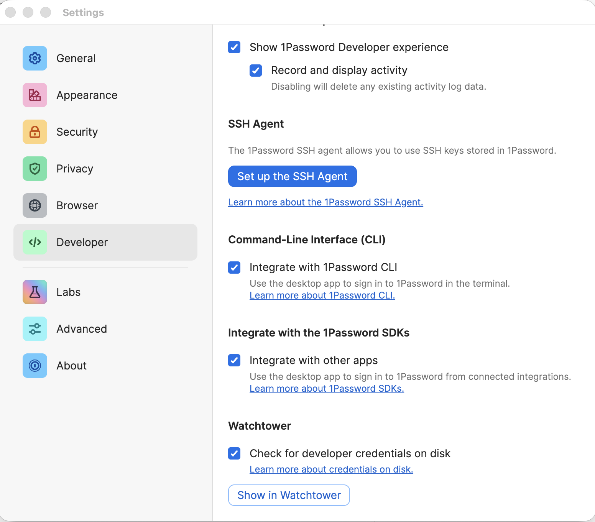
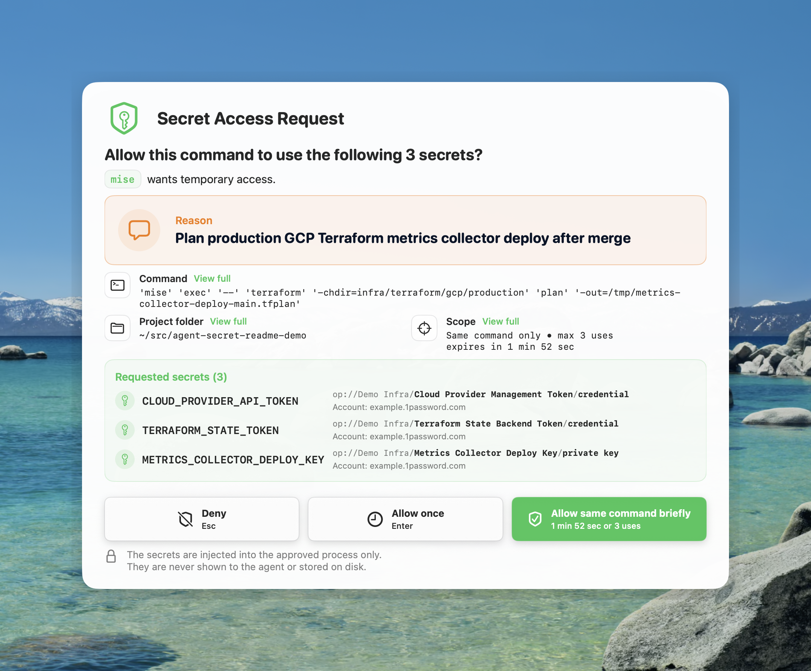
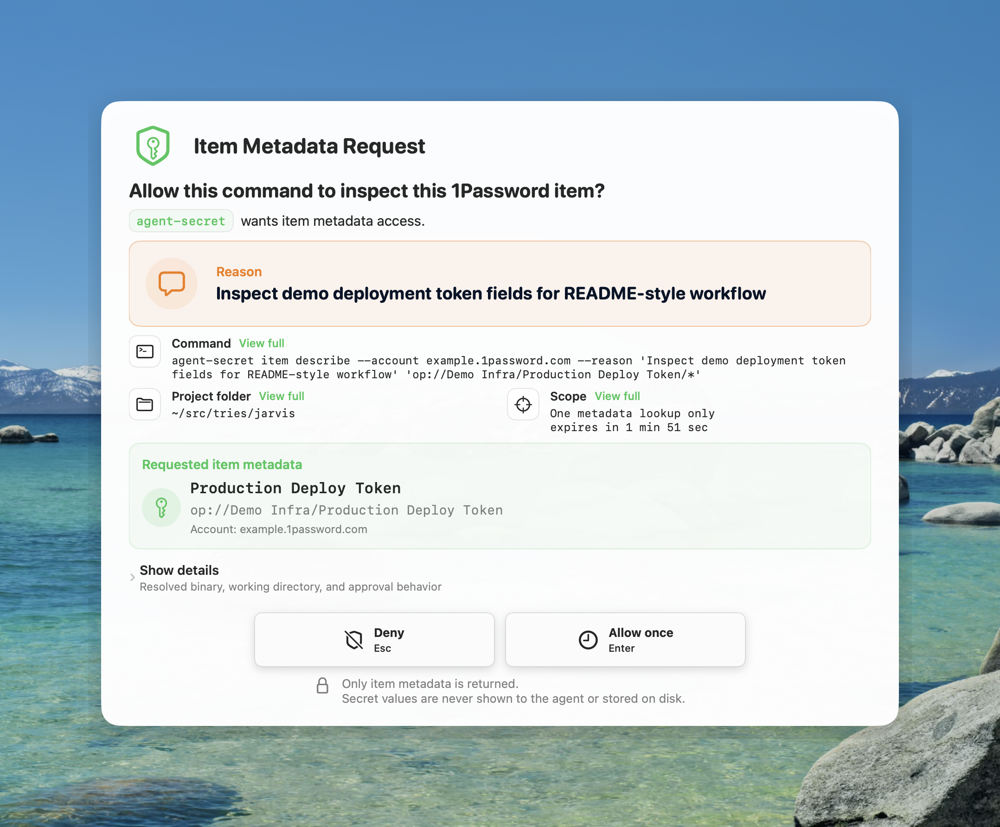

# Agent Secret

Agent Secret is a local macOS approval broker for coding-agent secrets. It lets
an agent request exact secret references, shows you a native approval
prompt with the command and reason, then injects approved values only into that
child process.

Website: <https://agent-secret.sh>

## Install

Requirements:

- macOS on Apple Silicon.
- 1Password desktop app signed in, unlocked, and with Developer Tools
  integration enabled.
- Optional for Bitwarden Secrets Manager: the official Bitwarden-signed `bws`
  CLI installed at `/opt/homebrew/bin/bws` or `/usr/local/bin/bws`, plus a
  Secrets Manager access token stored with Agent Secret.

Install the latest signed and notarized release with Homebrew:

```bash
brew tap kovyrin/agent-secret https://github.com/kovyrin/agent-secret
brew install --cask agent-secret
agent-secret skill-install
agent-secret doctor
```

Upgrade later with:

```bash
brew update
brew upgrade --cask agent-secret
```

The Homebrew cask installs `Agent Secret.app` into `/Applications` and links the
bundled `agent-secret` command into Homebrew's `bin` directory. `skill-install`
adds or repairs the bundled Codex skill symlink for the current user.

You can also install without Homebrew:

<!-- markdownlint-disable MD013 -->

```bash
curl -fsSL https://github.com/kovyrin/agent-secret/releases/latest/download/install.sh | sh
```

<!-- markdownlint-enable MD013 -->

Then verify the install:

```bash
agent-secret doctor
```

The unattended installer copies `Agent Secret.app` into `/Applications`, installs
`~/.local/bin/agent-secret`, installs the bundled Codex skill at
`~/.agents/skills/agent-secret`, and runs diagnostics. If `~/.local/bin` is not
on your shell `PATH`, the installer prints a copy-pasteable command to add it.

You can also install manually from the DMG on the
[latest GitHub Release](https://github.com/kovyrin/agent-secret/releases/latest):
open the DMG, drag `Agent Secret.app` into `/Applications`, open the app, and
click `Install Command Line Tool`.

## Enable 1Password SDK Integration

Agent Secret uses the 1Password desktop app SDK integration. In 1Password, open
`Settings -> Developer`, then under `Integrate with the 1Password SDKs` enable
`Integrate with other apps`. If the Developer section is hidden, enable
`Show 1Password Developer experience` first.



## Enable Bitwarden Secrets Manager

Install the official `bws` CLI, then store a local token alias in the macOS
Keychain:

```bash
agent-secret bitwarden secrets-manager token install --alias work
```

The install command prompts for the token with hidden terminal input. For
scripts, pipe the token with `--from-stdin`.

Bitwarden refs use `bws://<secret-uuid>` or
`bws://<source-alias>/<secret-uuid>`. Project configs can define
`sources.bitwarden` entries to map source aliases to token aliases. Agent
Secret v1 supports official Bitwarden cloud endpoints only and invokes `bws`
with a temporary state-disabled config pinned to `https://vault.bitwarden.com`.
It does not resolve `bws` from the daemon `PATH`; helper binaries must be at a
fixed common path and either live under a stable system-owned path or be signed
by Bitwarden Inc.

## Quick Start

Run a command with an explicitly approved secret:

```bash
agent-secret exec --reason "Run Terraform plan" \
  --secret CLOUDFLARE_API_TOKEN=op://Example/Cloudflare/token \
  -- terraform plan
```

Use a project profile:

```bash
agent-secret exec --profile terraform-cloudflare -- terraform plan
```

Validate what an agent is about to request without prompting or running the
child:

```bash
agent-secret exec --dry-run --json --profile terraform-cloudflare -- terraform plan
```

Use an existing reusable approval without opening a new prompt:

```bash
agent-secret exec --reuse-only --profile terraform-cloudflare -- terraform plan
```

Inspect item metadata without revealing values:

```bash
agent-secret item describe "op://Example Infra/Database Credentials"
agent-secret item describe --format env-refs --prefix DATABASE \
  "op://Example Infra/Database Credentials"
```

Inspect the agent-facing CLI surface or project profiles:

```bash
agent-secret agent-context --json
agent-secret profile list --json
agent-secret profile show --json terraform-cloudflare
```

## What You Approve



The approval UI emphasizes the reason for the request, the command, the working
directory, the approval scope, the requested aliases, and the exact secret
references. Secret values are not shown in the UI and are not returned to the
agent.

Metadata inspection has its own approval prompt:



## Project Profiles

Projects can store reusable secret mappings in `agent-secret.yml` or
`.agent-secret.yml`. The file contains 1Password secret references and request
metadata only, never resolved values.

```yaml
version: 1
default_profile: terraform-cloudflare

profiles:
  terraform-cloudflare:
    reason: Terraform DNS management
    ttl: 10m
    secrets:
      CLOUDFLARE_API_TOKEN: op://Example/Cloudflare/token
```

With `default_profile`, this works from the project directory:

```bash
agent-secret exec -- terraform plan
```

See [Configuration Reference](docs/configuration.md) for includes, account
precedence, env-file migration, and the full schema.

## Commands

- `agent-secret exec -- COMMAND [ARG...]`: run a command with approved secrets.
- `agent-secret item describe REF`: inspect 1Password item fields without
  values.
- `agent-secret agent-context --json`: print a machine-readable command and
  config discovery schema for coding agents.
- `agent-secret profile list|show`: inspect project profiles without resolving
  values.
- `agent-secret doctor`: print non-secret setup diagnostics.
- `agent-secret daemon status|start|stop`: inspect or control the per-user
  daemon.
- `agent-secret install-cli`: repair the command symlink for the current user.
- `agent-secret skill-install`: repair the bundled coding-agent skill symlink.

Run `agent-secret --help` or `agent-secret exec --help` for the full command
reference.

## Security Model

Agent Secret is a local approval broker, not a sandbox. The approved child
process receives the secret in its environment and can use or leak it like any
other process with that value.

What Agent Secret does protect:

- Project configs and command flags carry `op://` references, not resolved
  values.
- The daemon fetches only secrets approved for the current request.
- Audit logs contain metadata only, not raw secret values.
- Reusable approvals are bounded by command, cwd, secret references, account,
  TTL, and use count.
- Reusable cached values are kept in daemon memory and cleared when their scope
  is replaced, refreshed, expired, or when the daemon stops.

Out of scope:

- Root, the kernel, a compromised macOS user session, a compromised 1Password
  app, or a malicious approved child process.
- Hiding env vars from the operating-system APIs needed to launch the approved
  child process.
- Cross-platform secret management, background updates, session handles,
  credential helpers, file-descriptor delivery, or socket value reads.

Read [Threat Model](docs/threat-model.md) for the detailed model and review
ledger. Use the [Security Policy](SECURITY.md) for private vulnerability
reporting.

## Known Limitations

The launch build is intentionally narrow:

- macOS on Apple Silicon only.
- 1Password Desktop only.
- `agent-secret exec` only; no long-lived shell sessions.
- No writing, updating, or rotating secrets yet.
- No GCP Secret Manager or GCP token minting support yet.
- No sandbox guarantee after you approve a child process.

## Uninstall

Uninstall the latest release:

<!-- markdownlint-disable MD013 -->

```bash
curl -fsSL https://github.com/kovyrin/agent-secret/releases/latest/download/uninstall.sh | sh
```

<!-- markdownlint-enable MD013 -->

By default, uninstall removes the app, command symlink, skill symlink, and known
application support files. It leaves `~/Library/Logs/agent-secret` audit logs in
place unless `AGENT_SECRET_REMOVE_AUDIT_LOGS=1` is set.

## Development

Use `mise` as the project toolchain entrypoint:

```bash
mise run setup
mise run lint
mise run build
mise run test:smoke
```

Install the current development build on this machine:

```bash
mise dev:install
```

The dev installer places the app in `~/Applications/Agent Secret.app` by
default and refreshes the CLI and skill symlinks. It is for local development;
use the release installer above for normal installs.

## Maintainer Notes

- Release notes come from [Changelog](CHANGELOG.md).
- The maintainer release checklist lives in
  [Release Process](docs/release-process.md).
- Release artifacts are GitHub Releases backed by signed and notarized macOS
  DMGs.
- Tag-triggered GitHub releases require production signing and notarization.

Local release-candidate artifact build:

```bash
scripts/release/build-release.sh v0.0.0-dev
```

## Documentation

- [Configuration Reference](docs/configuration.md)
- [Threat Model](docs/threat-model.md)
- [Release Process](docs/release-process.md)
- [Security Policy](SECURITY.md)
- [Contributing](CONTRIBUTING.md)
- [Changelog](CHANGELOG.md)
